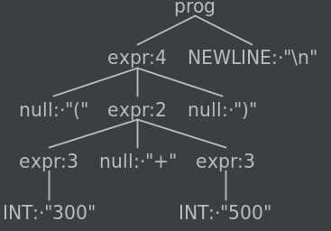

### Create aliases
First copy ```antlr-4.9.3-complete.jar``` file to ```/usr/local/lib/``` directory and then
append following to your bash configuration file ( ~/.bashrc file)

```shell
export CLASSPATH=".:/usr/local/lib/antlr-4.9.3-complete.jar:$CLASSPATH"
alias antlr4='java -jar /usr/local/lib/antlr-4.9.3-complete.jar'
alias grun='java org.antlr.v4.gui.TestRig'
```

Now you will be able to use ```antlr4``` and ```grun``` command from bash shell.

Grammar from https://www.antlr.org/: 

```antlrv4
grammar Expr;		
prog:	(expr NEWLINE)* ;
expr:	expr ('*'|'/') expr
    |	expr ('+'|'-') expr
    |	INT
    |	'(' expr ')'
    ;
NEWLINE : [\r\n]+ ;
INT     : [0-9]+ ;
```

If we use input like ```(300+500)\n``` we get following parse tree:



### Generating parser

```shell
antlr4 -Dlanguage=Cpp -o parser -no-listener -visitor groot.g4
```

This will generate the lexer, parser and visitor for the grammar defined. These are the file names those are generated:

```shell
grootBaseVisitor.cpp  
grootBaseVisitor.h  
groot.interp  
grootLexer.cpp  
grootLexer.h  
grootLexer.interp  
grootLexer.tokens  
grootParser.cpp  
grootParser.h  
groot.tokens  
grootVisitor.cpp  
grootVisitor.h 
```

